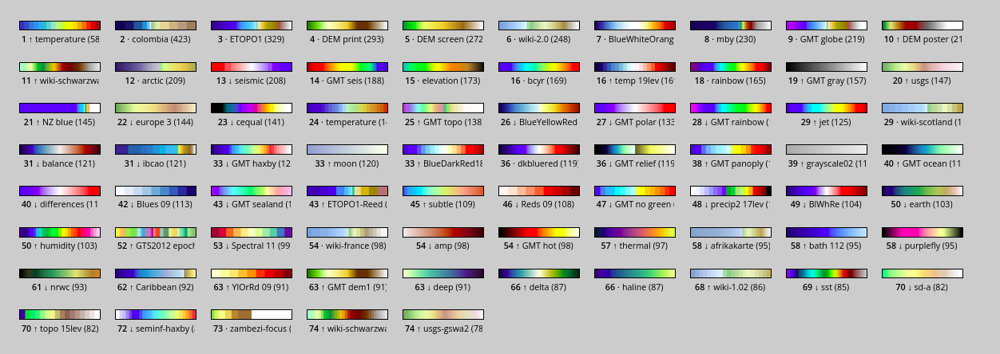
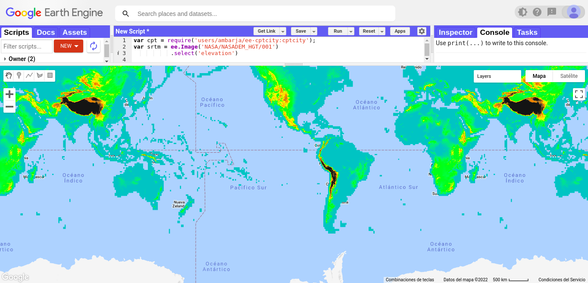

<!-- README.md is generated from README.Rmd. Please edit that file -->

# **cptcity for the Google Earth Engine JavaScript API (Code Editor)** <a href="#"></a>

<!-- badges: start -->

[](https://www.tidyverse.org/lifecycle/#experimental)

[](https://www.repostatus.org/#active)
<a href="https://opendatasicilia.it/" Title="Support">

<!-- badges: end -->

## 📋 **Table of contents**

1.  What is Google Earth Engine ?
2.  What is cptcity and why ?
3.  Top of the cpt palettes
4.  Calling module and use it!

### 🔴 **1. What is Google Earth Engine ?**

<a href="#"></a>
Google Earth Engine is a cloud-based platform that helps access
high-performance computing resources for processing and analyzing large
geospatial datasets [(Noel Golerick et
al.,2017).](https://www.sciencedirect.com/science/article/pii/S0034425717302900)

### 🔴 **2. What is cptcity and why ?**

Cptcity is a solium platform where you can find multiple colour palettes
for various themes related to cartography, technical illustration and
design. The archive supports various formats and is organised by author.
Cptcity currently has colour palettes for the most popular desktop
Geographic Information Systems such as **QGIS**, **GRASS** , **SAGA** ,
**ARCGIS** , and others. Currently, it has **7000 colour palettes**,
however in this second version of ee-cptcity module more than **300**
colour palettes were incorporated along with 2 popular palettes like
**rocket** , **mako** and **turbe**.

### 🔴 **3. Top of the cpt palettes**

The 75 most popular cpt files with the number downloaded shown in
parentheses. The arrows indicate the change in rank in the last month.
This list is compiled from the files downloaded in the last year (a
total of 21,647 files) and is updated irregularly, most recently on
04/03/2022.

<a href="http://soliton.vm.bytemark.co.uk/pub/cpt-city/views/totp-cpt.html">
 </a>

### 🔴 **4. Calling module and use it!**

```r
var cpt = require('users/ambarja/ee-cptcity:cptcity');
```

```r
var srtm = ee.Image('NASA/NASADEM_HGT/001')
           .select('elevation')

var viz = {
  min: 400,
  max: 4000,
  palette: cpt.pal.grass_elevation
  };
```

```r
Map.setZoom(1);
Map.addLayer(srtm,viz,'Elevation(m)');
```

 <br>

### 🔴 **5.Examples**

Please, visit our [webpage](https://ambarja.github.io/ee-cptcity/) where you find more examples with cptcity inside Js and R working with Google Earth Engine.

## 📚 **References**

- _David Montero, 2021, ee-pokepalettes,
  <https://github.com/davemlz/ee-pokepalettes>_

- _Gennadii Donchyts, Fedor Baart & Justin Braaten
  ,2020,<https://github.com/gee-community/ee-palettes>_

- _Sergio Ibarra Espinosa, 2017, cptcity,
  <https://github.com/ibarraespinosa/cptcity>_
