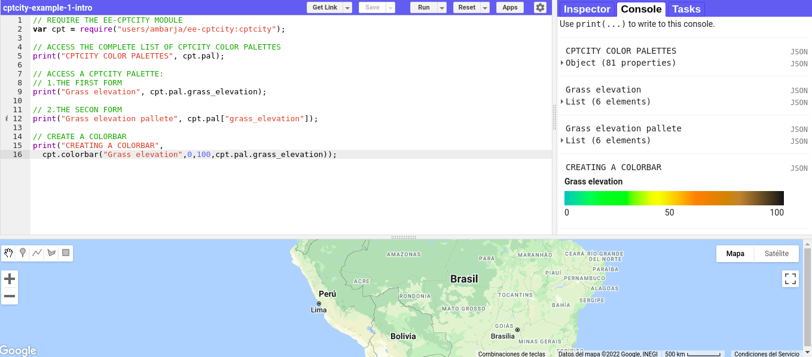
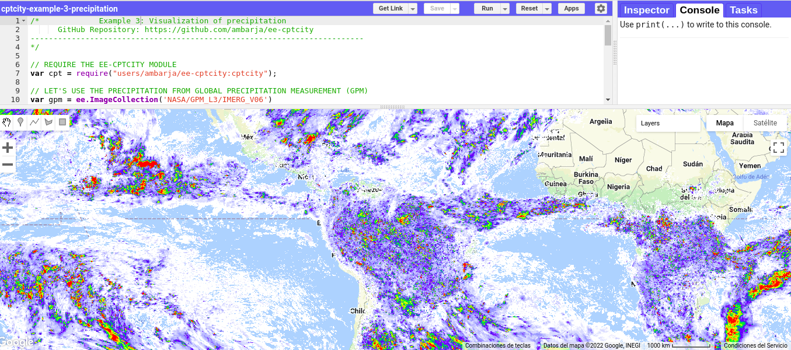
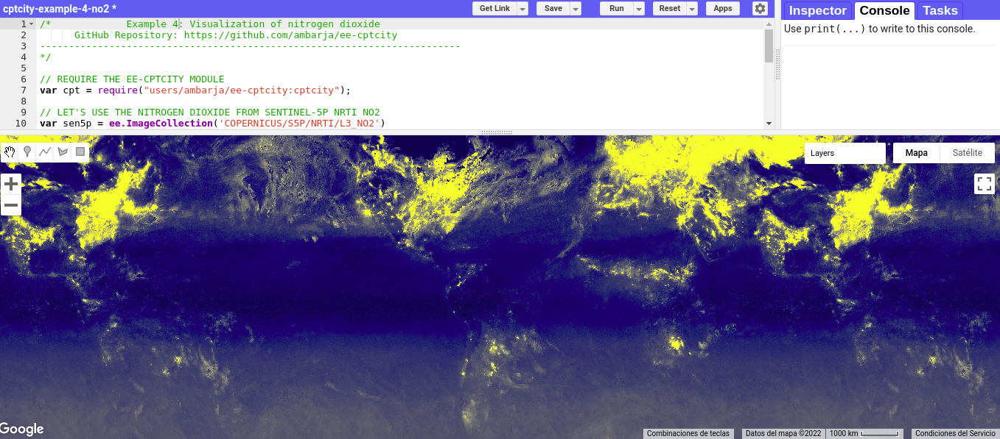

# **cptcity for the Google Earth Engine JavaScript API (Code Editor)**

<a href="#"></a>

<p align="center">
  <a href="#"></a> <a href="#"></a> <a href="#"></a> <a href="#"></a> <a href="https://www.linkedin.com/in/antonybarja/"></a> <a href="https://twitter.com/antony_barja"></a> <a href="https://ambarja.github.io/"></a> <a href="https://www.youtube.com/channel/UCuWvYTTYCZBmbDoEbsY2MSw"></a> <a href="https://discord.gg/R5YtFxWbJr"></a> <a href="https://t.me/ambarja"></a> <a href="https://ko-fi.com/ambarja"></a>
</p>

## 📋 **Table of contents**

1. What is Google Earth Engine ?
2. Why cptcity ?
3. Top of the cpt palettes
4. Calling module and use it!
5. Examples

### 🔴 **1. What is Google Earth Engine ?**

<a href="#"></a>
Google Earth Engine is a cloud-based platform that helps access high-performance computing resources for processing and analyzing large geospatial datasets [(Noel Golerick et al.,2017).](https://www.sciencedirect.com/science/article/pii/S0034425717302900)

### 🔴 **2. What is cptcity and why ?**

cptcity is a platform of solium where you can find multiple pallete colors for diverses thematics relatioship with the cartography, technical illustration and design.
The archive supports several formats and is organised by author.
cptcity current has color palettes of the most popularity desk Geographycal Information System like **QGIS**, **GRASS** , **SAGA** , **ARCGIS** , and others.
Current has **7000** palettes of colors, however in this first version of ee-cptcity were incorpored only Top of the cpt palettes (**75**) and **6** palettes more popular like **grass_slope, viridis, cividis, magma, plasma and inferno.**

### 🔴 **3. Top of the cpt palettes**

The 75 most popular cpt files with the number downloaded shown in parentheses. The arrows indicate the change in rank in the last month. This list is compiled from the files downloaded in the last year (a total of 21,647 files) and is updated irregularly, most recently on 04/03/2022.

<a href="http://soliton.vm.bytemark.co.uk/pub/cpt-city/views/totp-cpt.html">
 
</a>

### 🔴 **4. Calling module and use it!**

```{js}
var cpt = require('users/ambarja/ee-cptcity:cptcity');
```

```{js}
var srtm = ee.Image('NASA/NASADEM_HGT/001')
           .select('elevation')

var viz = {
  min: 400,
  max: 4000,
  palette:cpt.pal.dem_poster
  };
```

```{js}
Map.addLayer(srtm,viz,'Elevation(m)');
```

### 🔴 **5. Examples**

1. **cptcity-example-1-intro** <a href="https://code.earthengine.google.com/c6879919ca2afb5b6b9dfc622ee78a4b"></a>



<br/>

2. **cptcity-example-2-ndvi** <a href="https://code.earthengine.google.com/fc6231e0cb1976919141a4a255baf78a"></a>


<br/>

3. **cptcity-example-3-precipitation** <a href="https://code.earthengine.google.com/84381f50bb9f021ad2a020da59c2440c"></a>



<br/>

4. **cptcity-example-4-NO2** <a href="https://code.earthengine.google.com/9f71b8b7ad985a88361d16f24f51cc75"></a>



<br/>

## 📚 **References**

- _David Montero, 2021, ee-pokepalettes, https://github.com/davemlz/ee-pokepalettes_

- _Gennadii Donchyts, Fedor Baart & Justin Braaten ,2020,https://github.com/gee-community/ee-palettes_

- _Sergio Ibarra Espinosa, 2017, cptcity, https://github.com/ibarraespinosa/cptcity_
